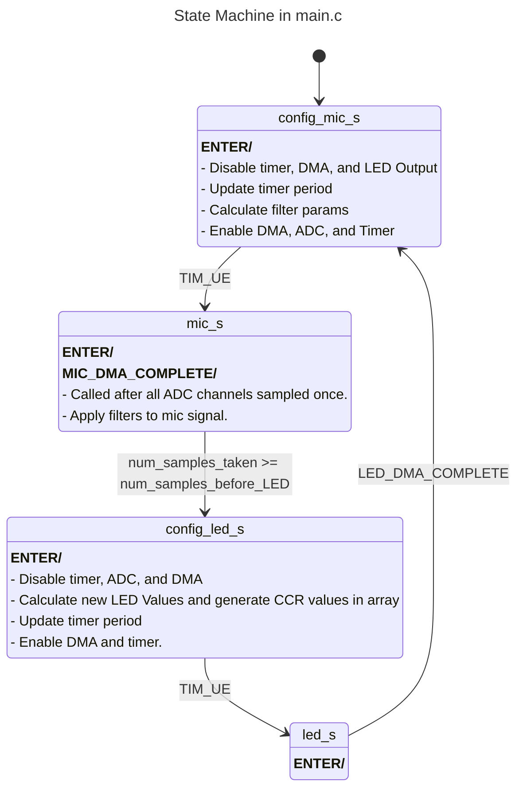

# File Structure Tour

TBD

# Firmware

## State Machine

The program is responsible for both filtering microphone samples and updating LEDs based on the filtered signals. This behavior is achieved by cycling through a loop in a state machine shown below.

The loops takes advantage of persistence of vision i.e. we can take a number of microphone samples then pause periodically to update LED values.  Note that the timer is used both for triggering samples of the microphone, then repurposed in output compare mode to communicate with the LEDs.

## Microphone Filtering

